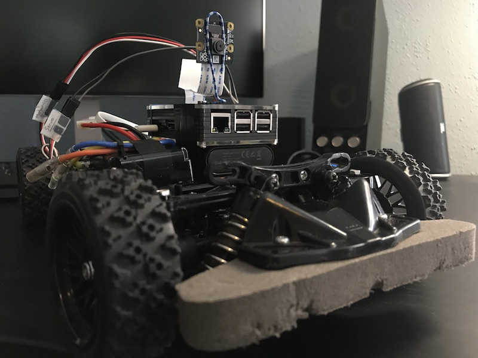

# AutoDrive: Building a self-driving toy car

## Project Objectives:

We will be building a small-scale prototype of an autonomous vehicle through the following means:

1. Assemble a raspberry-pi-controlled racing car mounted with camera and ultrasound sensor
1. Train a deep learning model to
   1. clone regular driving behavior along a track (this can be made of printing paper laid on two sides)
   1. detect miniature traffic signs and respond accordingly
1. Detect and circumvent hindering obstacles on the track using sensor data
1. Explore efficient perception and planning algorithms operable in IoT devices like raspberry pi and augmentation hardware like the Intel Movidius Compute Stick

We hope that this prototype can serve as a tool to investigate
1. Efficient software stack in a computation-constrained environment like a raspberry pi
2. How ethical principle can be implemented in the software stack of an intelligent agent

## Table of Content:
1. [Project Objectives](#project-objectives)
1. [Software Architecture](#software-architecture)
    - [Technical Overview](#technical-overview)
1. [Materials](#materials)
1. [Hardware Specs](#hardware-specs)
1. [Circuit Schematics](#circuit-schematics)
1. [Dependency Installation (On Raspberry Pi 3b)](#dependency-installation)
    - [Connect to Raspberry Pi](#connect-to-raspberry-pi)
    - [Install virtualenv and virtualenvwrapper](#install-virtualenv-and-virtualenvwrapper)
    - [Install Full Dependencies](#install-full-dependencies)
1. [Problems Encountered and Solutions](#problems-encountered-and-solutions)
    - [Initial Setup](#initial-setup)
    - [Installing Dependencies](#installing-dependencies)
    - [Control Motor Motion via GPIO](#control-motor-motion-via-gpio)
1. [Resources and References](#resources-and-references)
    - [Initial Setup](#initial-setup-ref)
    - [Installing Dependencies](#installing-dependencies-ref)
    - [Control Motor Motion via GPIO](#pulse-width-modulation-and-gpio-ref)
    - [End to End Neural Network](#end-to-end-neural-network-ref)

## Software Architecture

An autonomous vehicle has 5 major components as follow:

1. Perception (Computer Vision, ML)
2. Sensor Fusion and Localization (LIDAR, Kalman, Particle Filters, and Mapping)
3. Motion Planning and Decision Making (Incremental Search Alg (D*), Sampling Planning Alg, Planning w/ uncertainty)
4. Control
5. System Integration

However, it is not practical to implement the full software stack of an autonomous vehicle into our project. For the early stage of the project, the focus will be set on both **Control** and **Computer Vision**. 

### Technical Overview

For simplicity, we will consider the car's motion into **two separate and independent motions:** transverse motion (left and right) and longitudinal motion (forward and backward). 

To control the car's transverse motion, we will construct a CNN based end-to-end neural network that takes an image and outputs the steering command needed to keep the car in the middle . This neural network will be trained over video footage of correct driving behavior on a track (i.e. staying in the middle of the track while turning) and ideally should replicate the same behavior when tested on unseen tracks. To imitate such behavior, input the neural network an image of the track and the network will output the steering angle of the car needed to stayed on the track. We will use [Nvidia's model](https://images.nvidia.com/content/tegra/automotive/images/2016/solutions/pdf/end-to-end-dl-using-px.pdf) to implement this behavioral cloning network. I have implemented a similar behavioral cloning network in a [different project](https://github.com/JohnGee96/CarND-Behavioral-Cloning) with very similar task. I will transfer the same model used that project for this specific task.

To control the car's longitudinal motion, we will first implement a simple decision model as follow: keep moving forward until encountering an obstacle. We can use data from an ultrasonic sensor to detect if there any hindering obstacle in front of the car. Later, we can add road conditions to the forward motion including stopping for 3 seconds if the car sees a stop sign. 

## Materials:
1. Toy Car [(Tamiya TT02 Chasis)](https://www.tamiyausa.com/shop/110-4wd-shaft-drive-road-tt/rc-nsx/tt-02/)
1. Raspberry Pi 3b
1. Raspberry Pi Camera
1. HC-SR05 Ultrasonic Sensor
1. SD Card (16 GB minimum)
1. Power Bank
1. Breadboard
1. Ethernet Cable (For internal SSH connect without)
1. Ethernet Adaptor (If necessary)
1. Wires

## Hardware Specs:

1. **540j Motor (Comes with Tamiya TT02)**
    * *Motor Output Voltage*: 6.03V
    * *Motor Pulse Width Range:* 1200-1469 ms

1. **Tactic TSX40 High-Torque Servo**
    * *Input Voltage:* 4.8/6.0V
    * *Output Torque (@ 60 degree):* 0.16/0.13 sec
    * *Servo Pulse Width Range:* 1150 - 1850 (1500 is Neutral)

## Circuit Schematics

### Raspberry Pi GPIO Pin

- MOTOR_PIN = 13
- SERVO_PIN = 19

## Software Dependencies

1. Python 3.5
1. Pillow 5.3.0 (Python Imaging Library)
1. Matplotlib 2.2.2
1. Numpy 1.15.4
1. Keras 1.2.1
1. Tensorflow 1.8
1. OpenCV 3.4.3 (Here we install[`opencv-python-headless`](https://pypi.org/project/opencv-python-headless/) from pywheel. It is an unofficial pre-built OpenCV package)
1. pigpio 1.38 (Natively installed on Raspbian Linux)
1. picamera 1.13 (Natively installed on Raspbian Linux)
1. [Udacity Self-Driving Car Simulator](https://github.com/udacity/self-driving-car-sim) (For training the end-to-end neural network)

## Dependency Installation 

Instructions for installing the dependencies on a Raspberry Pi 3b running `Raspbian v9.1` linux with Kernel version `4.9.59` using `armv7l` instructions. 

### Connect to Raspberry Pi

This assumes a headless setup (without hooking up to a monitor) with SSH enabled. For more details on headless setup, see this [post](https://hackernoon.com/raspberry-pi-headless-install-462ccabd75d0).

Skip this step if not using a headless setup.

1. Try pinging the raspberry: `ping raspberrypi.local`
    -  This should work if mDNS is enabled. See [Setup mDNS for assigning .local domain to Raspberry Pi](https://www.howtogeek.com/167190/how-and-why-to-assign-the-.local-domain-to-your-raspberry-pi/)

1. ssh into it: `ssh pi@raspberrypi.local`.

If `raspberrypi.local` is unresponsive:

1. Connect via Wifi
    - Find raspberry's ip (You can find this in your Router’s DHCP lease allocation table)
        - You can use `nmap` to scan your network to locate the raspberry pi: `nmap -v -sn <ROUTER_IP>/24`
    - `ssh pi@<IP_ADDRESS>`

1. Connect via ethernet cable
    - Scan internal for active IP: `nmap -v -sn 192.168.0.0/16`
    - `ssh pi@<IP_ADDRESS>`

You can also set a static IP address for your convenience:

Assume you have gain access onto the pi, configure static internal ip address in `/etc/dhcpcd.conf` as follow:

        interface eth0
        static ip_address=192.168.2.2/24
        static routers=192.168.2.1
        static domain_name_servers=192.168.2.1

        interface wlan0
        static ip_address=192.168.2.2/24
        static routers=192.168.2.1
        static domain_name_servers=192.168.2.1

Now you can ssh into the pi with static ip: `ssh pi@192.168.2.2`

### Install virtualenv and virtualenvwrapper

1. ``sudo pip3 install virtualenv virtualenvwrapper``

1. Append the following onto the ~/.bashrc

        # virtualenv and virtualenvwrapper
        export WORKON_HOME=$HOME/.virtualenvs
        export VIRTUALENVWRAPPER_PYTHON=/usr/local/bin/python3
        source /usr/local/bin/virtualenvwrapper.sh

1. Run `` source ~/.bashrc``. 
    - Below are some of the basic commands for virtualenvwrapper. Refer to the [doc](https://virtualenvwrapper.readthedocs.io/en/latest/) for more details:

        - `mkvirtualenv` : Make a new virtual environment.
        - `workon` : Activate/switch to a virtual environment. Remember, you can have as many environments as you’d like.
        - `deactivate` : Jumps out of a virtual environment and you’ll be working with your system.
        - `rmvirtualenv` : Deletes a virtual environment.

1. Create a new virtual environment call `autodrive`

        mkvirtualenv autodrive -p python3

### Install Full Dependencies

1. Install required shared libraries

        sudo apt-get update
        sudo apt-get install libatlas-base-dev
        sudo apt-get install libjasper-dev
        sudo apt-get install libhdf5-dev
        sudo apt-get install libhdf5-serial-dev
        sudo apt-get install python3-gi-cairo

1. Install all dependencies with pip (this can take up to 10 minutes)

        pip3 install -r requirements.txt

1. Toggle on system-wide packages (hack for resolving dependencies for `matplotlib` in Python 3.5.X environment). This also brings into the virtual environment both `picamera` and `pigpio` libraries that are natively installed on raspbian linux. 

        toggleglobalsitepackages autodrive

    NOTE: `toggleglobalsitepackages` will make the virtual environment include global package. To turn off, simply call `toggleglobalsitepackages autodrive` again.

## Problems Encountered and Solutions:

### Initial Setup
1. Troublesome Remote Access (SSH) to Raspberry Pi due to dynamic IP  

    Solution 1:

    Create a .local domain name via mDNS and/or configure static IP through configuring DHCP request (see [Setup mDNS for assigning .local domain to Raspberry Pi](https://www.howtogeek.com/167190/how-and-why-to-assign-the-.local-domain-to-your-raspberry-pi/)(#Resources-and-References)).  

    Solution 2:

    Configure static internal ip address in /etc/dhcpcd.conf
    as follow:

        interface eth0
        static ip_address=192.168.2.2/24
        static routers=192.168.2.1
        static domain_name_servers=192.168.2.1

        interface wlan0
        static ip_address=192.168.2.2/24
        static routers=192.168.2.1
        static domain_name_servers=192.168.2.1

1. Stream video from Raspberry Cam

    Host webserver or open socket from VLC (see [Setup video streaming in various methods]).

    To turn on video stream on the Pi:

        /opt/vc/bin/raspivid -o - -t 0 -hf -w 640 -h 360 -fps 25|cvlc -vvv stream:///dev/stdin --sout '#standard{access=http,mux=ts,dst=:8090}' :demux=h264

    To open the video stream on VLC player:

        http://<IP-OF-THE-RPI>:8090

    NOTE: Streaming using VLC player introduces extensively footage latency (2-3 seconds) through a ethernet connection.

1. Controlling RC car with Raspberry Pi

    Connect Raspberry Pi's GPIO with the motor and servo of the RC car according to the hardware schematics

### Installing Dependencies

1. Install OpenCv on Raspberry Pi

    See the [post](https://www.pyimagesearch.com/2018/09/19/pip-install-opencv/)

1. Numpy and h5py are missing shared libraries object files. 

    Install libatlas-base-dev and libhdf5-serial-dev

1. Matplotlib has problem connect with its dependency on GUI frameworks (GTK, cairo, qt4, etc...). Not be a problem unless if you want to show figures interactively. Also can avoid with printing inline in a Jupyter Notebook.

    1. When matplotlib is installed in the venv natively, it's likely to complain about missing `gi` module as its dependency. If so, install system-wide `gi` and `cairo` as follow and toggle on system-wide package access:

            sudo apt-get install python3-gi-cairo
            toggleglobalsitepackages autodrive

        NOTE: `toggleglobalsitepackages` will toggle off the intended barrier between system-wide dependencies and the virtual environment.

    2. You may see the error `"The Gtk3Agg backend is not known to work on Python 3.x."` because `pycairo` is not compatible with Python3.X. Install a local version of `cairocffi`

            pip3 install cairocffi

### Control Motor Motion via GPIO

1. Develop basic software-hardware interface

    Build principle software foundation by mapping the tolerable pulse-width range of the hardware to measurable actions on the hardware. For example, turning the servo 15 degree left or run the motor on 50% power (See [`./control`](./control/)).

1. Mapping the relationship between PWM signal and the induced steering angle

    The [GPIO library](http://abyz.me.uk/rpi/pigpio/python.html#set_servo_pulsewidth) provides the `set_servo_pulsewidth` method to control the width of a pulse signal within the range of `[500-2500]`. We conducted an experiment to measure the steering angle of the servo induced from this pulse width range (See [./resources/servo_experiment](/resources/servo_experiment)):

    

    

    

    There is linear relationship between pulse width and the induced steering angle.

    - Left Turn (width: 1200 - 1450): `17.9x + 1439`
    - Right Turn (width: 1550 - 1800): `15.9x + 1561`

    Through more test on the hardware, I found it more fitting to use one linear mapping, particularly `17.9x + 1439`, as it produce more balanced steering angle around the range between `[-18, 18]` for steering angle degree and `[1200, 1780]` for pulse width.

## Resources and References:

### Initial Setup Ref

1. [Setup mDNS for assigning .local domain to Raspberry Pi](https://www.howtogeek.com/167190/how-and-why-to-assign-the-.local-domain-to-your-raspberry-pi/)
1. [Setup static IP through DHCP](https://raspberrypi.stackexchange.com/questions/37920/how-do-i-set-up-networking-wifi-static-ip-address/74428#74428)
1. [Setup video streaming in various methods](https://raspberrypi.stackexchange.com/questions/27082/how-to-stream-raspivid-to-linux-and-osx-using-gstreamer-vlc-or-netcat)
1. [Compile FFmpeg in Raspberry Pi to stream video over web server](https://johnvoysey.wordpress.com/2014/05/07/raspberry-pi-camera-live-streaming/)

### Installing Dependencies Ref

1. [Virtualenvwrapper Doc](https://virtualenvwrapper.readthedocs.io/en/latest/)
1. [Install OpenCV on Raspberry Pi](https://www.pyimagesearch.com/2018/09/19/pip-install-opencv/)
1. [Working with Matplotlib in Virtual environments](https://matplotlib.org/faq/virtualenv_faq.html#working-with-matplotlib-in-virtual-environments)

### Pulse Width Modulation and GPIO Ref

1. [Raspberry Pi Controlled ESC and Motor](https://www.youtube.com/watch?v=br_Xv9X7YZc)
1. [PWM and Motor Motion](https://www.electronics-tutorials.ws/blog/pulse-width-modulation.html)
1. [PWM Frequency for Controlling Servo Rotation Angle](https://electronics.stackexchange.com/questions/129961/how-to-get-the-pwm-frequency-and-duration-of-each-pulse)
1. [GPIO Electrical Specifications](http://www.mosaic-industries.com/embedded-systems/microcontroller-projects/raspberry-pi/gpio-pin-electrical-specifications)
1. [PIGPIO Library API](http://abyz.me.uk/rpi/pigpio/python.html#set_servo_pulsewidth)

### End to End Neural Network Ref

1. [Behavioral Cloning](https://github.com/JohnGee96/CarND-Behavioral-Cloning) - Udacity Self-Driving Car Nanodegree Project
1. [Nvidia's End to End Paper](https://images.nvidia.com/content/tegra/automotive/images/2016/solutions/pdf/end-to-end-dl-using-px.pdf)
