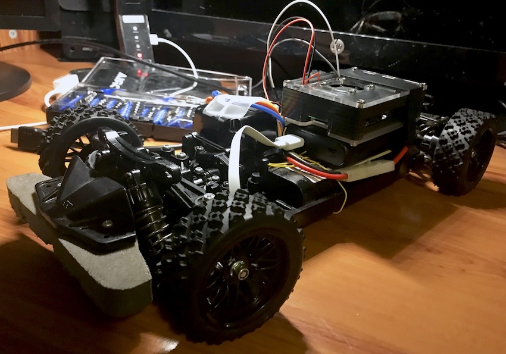
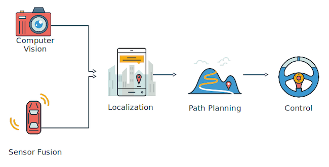
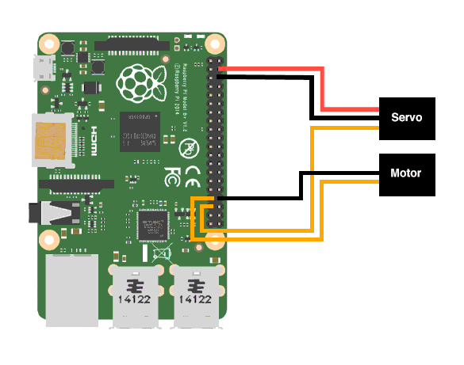
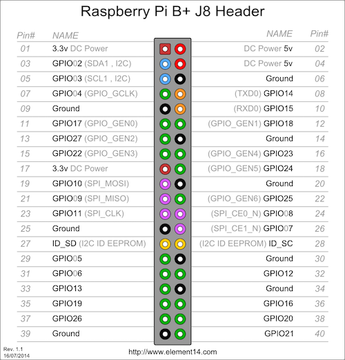

# AutoDrive: Building a self-driving toy car

## Project Objectives:

We will be building a small-scale prototype of an autonomous vehicle through the following means:

1. Assemble a raspberry-pi-controlled racing car mounted with camera and ultrasound sensor
1. Train a deep learning model to
   1. clone regular driving behavior along a track (this can be made of printing paper laid on two sides)
   1. detect miniature traffic signs and respond accordingly
1. Detect and circumvent hindering obstacles on the track using sensor data
1. Explore efficient perception and planning algorithms operable in IoT devices like raspberry pi and augmentation hardware like the Intel Movidius Compute Stick

We hope that this prototype can serve as a tool to investigate
1. Efficient software stack in a computation-constrained environment like a raspberry pi
2. How ethical principle can be implemented in the software stack of an intelligent agent

## Table of Content:
1. [Project Objectives](#project-objectives)
1. [Software Architecture](#software-architecture)
1. [Materials](#materials)
1. [Hardware Specs](#hardware-specs)
1. [Circuit Schematics](#circuit-schematics)
1. [Problems Encountered and Solutions](#problems-encountered-and-solutions)

## Software Architecture

A real autonomous vehicle has 5 major components as follow:

1. Perception (Computer Vision, ML)
2. Sensor Fusion and Localization (LIDAR, Kalman, Particle Filters, and Mapping)
3. Motion Planning and Decision Making (Incremental Search Alg (D*), Sampling Planning Alg, Planning w/ uncertainty)
4. Control
5. System Integration

However, it is not practical to implement the full software stack of an autonomous vehicle into our project. For the early stage of the project, the focus will be set on both **Control** and **Computer Vision**. 

For simplicity, we will consider the car's motion into **two separate and independent motion axes:** x-axis (left and right) and y-axis (forward and backward). 

To control the car's x-direction motion, we will construct a CNN based behavioral cloning neural network. This neural network will be trained over video footage of correct driving behavior on a track (i.e. staying in the middle of the track while turning) and ideally should replicate the same behavior when tested on unseen tracks. To imitate such behavior, input the neural network an image of the track and the network will output the steering angle of the car needed to stayed on the track. We will use [Nvidia's model](https://images.nvidia.com/content/tegra/automotive/images/2016/solutions/pdf/end-to-end-dl-using-px.pdf) to implement this behavioral cloning network. I have implemented a similar behavioral cloning network in a [different project](https://github.com/JohnGee96/CarND-Behavioral-Cloning) with very similar task. I will transfer the same model used that project for this specific task.

To control the car's forward motion, we will first implement a simple decision model as follow: keep moving forward until encountering an obstacle. We can use data from an ultrasonic sensor to detect if there any hindering obstacle in front of the car. Later, we can add road conditions to the forward motion including stopping for 3 seconds if the car sees a stop sign. 

## Materials:
1. Toy Car (Tamiya TT02)
1. Raspberry Pi 3b
1. Raspberry Pi Camera
1. HC-SR05 Ultrasonic Sensor
1. Power Bank
1. Breadboard
1. Wires

## Hardware Specs:

1. **540j Motor (Comes with Tamiya TT02)**
    * *Motor Output Voltage*: 6.03V
    * *Motor Pulse Width Range:* 1200-1469 ms

1. **Tactic TSX40 High-Torque Servo**
    * *Input Voltage:* 4.8/6.0V
    * *Output Torque (@ 60 degree):* 0.16/0.13 sec
    * *Servo Pulse Width Range:* 1150 - 1850 (1500 is Neutral)

## Circuit Schematics

### Raspberry Pi GPIO Pin

- MOTOR_PIN = 13
- SERVO_PIN = 19

## Problems Encountered and Solutions:

### Initial Setup
1. Troublesome Remote Access (SSH) to Raspberry Pi due to dynamic IP  

    Solution 1:

    Create a .local domain name via mDNS and/or configure static IP through configuring DHCP request (See [reference #1-2](#Resources-and-References))  

    Solution 2:

    Configure static internal ip address in /etc/dhcpcd.conf
    as follow:

        interface eth0
        static ip_address=192.168.2.2/24
        static routers=192.168.2.1
        static domain_name_servers=192.168.2.1

        interface wlan0
        static ip_address=192.168.2.2/24
        static routers=192.168.2.1
        static domain_name_servers=192.168.2.1

1. Stream video from Raspberry Cam

    Host webserver or open socket from VLC (See [reference #3-4](#Resources-and-References))

1. Controlling RC car with Raspberry Pi

    Connect Raspberry Pi's GPIO with the motor and servo of the RC car according to the hardware schematics

### Control Motor Motion via GPIO

1. Develop basic software-hardware interface

    Build principle software foundation by mapping the tolerable pulse-width range of the hardware to measurable actions on the hardware. For example, turning the servo 15 degree left or run the motor on 50% power (See [`./control`](./control/)).

1. Mapping the relationship between PWM signal and the induced steering angle

    The [GPIO library](http://abyz.me.uk/rpi/pigpio/python.html#set_servo_pulsewidth) provides the `set_servo_pulsewidth` method to control the width of a pulse signal within the range of `[500-2500]`. We conducted an experiment to measure the steering angle of the servo induced from this pulse width range (See [./resources/servo_experiment](/resources/servo_experiment)):

    

    

    

    There is linear relationship between pulse width and the induced steering angle.

    - Left Turn (width: 1200 - 1450): `17.9x + 1439`
    - Right Turn (width: 1550 - 1800): `15.9x + 1561`

    Through more test on the hardware, I found it more fitting to use one linear mapping, particularly `17.9x + 1439`, as it produce more balanced steering angle around the range between `[-18, 18]` for steering angle degree and `[1200, 1780]` for pulse width.

## Resources and References:

### Initial Setup

1. [Setup mDNS for assigning .local domain to Raspberry Pi](https://www.howtogeek.com/167190/how-and-why-to-assign-the-.local-domain-to-your-raspberry-pi/)
1. [Setup static IP through DHCP](https://raspberrypi.stackexchange.com/questions/37920/how-do-i-set-up-networking-wifi-static-ip-address/74428#74428)
1. [Setup video streaming in various methods](https://raspberrypi.stackexchange.com/questions/27082/how-to-stream-raspivid-to-linux-and-osx-using-gstreamer-vlc-or-netcat)
1. [Compile FFmpeg in Raspberry Pi to stream video over web server](https://johnvoysey.wordpress.com/2014/05/07/raspberry-pi-camera-live-streaming/)

### Pulse Width Modulation and GPIO

1. [Raspberry Pi Controlled ESC and Motor](https://www.youtube.com/watch?v=br_Xv9X7YZc)
1. [PWM and Motor Motion](https://www.electronics-tutorials.ws/blog/pulse-width-modulation.html)
1. [PWM Frequency for Controlling Servo Rotation Angle](https://electronics.stackexchange.com/questions/129961/how-to-get-the-pwm-frequency-and-duration-of-each-pulse)
1. [GPIO Electrical Specifications](http://www.mosaic-industries.com/embedded-systems/microcontroller-projects/raspberry-pi/gpio-pin-electrical-specifications)
1. [PIGPIO Library API](http://abyz.me.uk/rpi/pigpio/python.html#set_servo_pulsewidth)